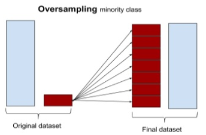
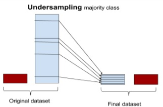

```{r message=FALSE, warning=FALSE}
library(party)
telco <- read.csv("WA_Fn-UseC_-Telco-Customer-Churn.csv", header=TRUE)
```


```{r}
str(telco)
```

## Convert Data

### Data Sampling
```{r}
index <- sample(2, nrow(telco), replace=TRUE, prob=c(0.7,0.3) )
traindata <- telco[index==1,]
testdata <- telco[index==2,]
sprintf("Number of Record in Training Dataset is %d" , nrow(traindata))
sprintf("Number of Record in Testing Dataset is %d" , nrow(testdata))
```

### Train Model
```{r}
library(nnet)
formular <- Churn ~ gender + SeniorCitizen + Partner + tenure + PhoneService + MultipleLines + OnlineBackup + Contract + PaperlessBilling + PaymentMethod + MonthlyCharges + TotalCharges
multi_model <- multinom(formular, data = traindata)
summary(multi_model)
```


### Evaluate Model
```{r}
confusionmatrix <- table(predict(multi_model, newdata=traindata), traindata$Churn)
confusionmatrix
normal_train_accuracy <- (confusionmatrix[1,1]+confusionmatrix[2,2])/
  (confusionmatrix[1,1]+confusionmatrix[2,2]+confusionmatrix[1,2]+confusionmatrix[2,1])
print(normal_train_accuracy)
```

### Evaluate Testing Model
```{r}
confusionmatrix <- table(predict(multi_model, newdata=testdata), testdata$Churn)
confusionmatrix
normal_test_accuracy <- (confusionmatrix[1,1]+confusionmatrix[2,2])/
  (confusionmatrix[1,1]+confusionmatrix[2,2]+confusionmatrix[1,2]+confusionmatrix[2,1])
print(normal_test_accuracy)
```
### Handling Imbalanced Data
- Over Sampling
- Under Sampling
- Both Sampling
- ROSE Sampling
- Synthetic Minority Over-Sampling Technique (SMOTE) Sampling 




## Resample Data
```{r}
library(DMwR)
library(ROSE)

print('Number of transactions in dataset before applying sampling methods')
print(table(telco$Churn))

# Oversampling, 
# Here N= 5174*2
over_sample_data <- ovun.sample(Churn ~ ., data = telco, method="over", N=10348)$data
print('Number of transactions in dataset after applying Over sampling method')
print(table(over_sample_data$Churn))

# Undersampling, N=1869*2. 
under_sample_data <- ovun.sample(Churn ~ ., data = telco, method="under", N=3738)$data
print('Number of transactions in dataset after applying Under sampling method')
print(table(under_sample_data$Churn))

# Mixed Sampling, apply both under sampling and over sampling on this imbalanced data
both_sample_data <- ovun.sample(Churn ~ ., data = telco, method="both", p=0.5, seed=222, N=5174)$data
print('Number of transactions in dataset after applying Mixed sampling method')
print(table(both_sample_data$Churn))

# ROSE Sampling, this helps us to generate data synthetically. It generates artificial datas instead of dulicate data.
rose_sample_data <- ROSE(Churn ~ ., data = telco,  seed=111)$data
print('Number of transactions in dataset after applying ROSE sampling method')
print(table(rose_sample_data$Churn))

# SMOTE(Synthetic Minority Over-sampling Technique) Sampling
# formula - relates how our dependent variable acts based on other independent variable.
# data - input data
# perc.over - controls the size of Minority class
# perc.under - controls the size of Majority class
smote_sample_data <- SMOTE(Churn ~ ., data = telco, perc.over = 100, perc.under=200)
print('Number of transactions in dataset after applying SMOTE sampling method')
print(table(smote_sample_data$Churn))
```

### Data Sampling (Over Sample)
```{r}
index <- sample(2, nrow(over_sample_data), replace=TRUE, prob=c(0.7,0.3) )
traindata <- over_sample_data[index==1,]
testdata <- over_sample_data[index==2,]
sprintf("Number of Record in Training Dataset is %d" , nrow(traindata))
sprintf("Number of Record in Testing Dataset is %d" , nrow(testdata))
```

### Train Model (Over Sample)
```{r}
library(nnet)
formular <- Churn ~ gender + SeniorCitizen + Partner + tenure + PhoneService + MultipleLines + OnlineBackup + Contract + PaperlessBilling + PaymentMethod + MonthlyCharges + TotalCharges
multi_model <- multinom(formular, data = traindata)
summary(multi_model)
```


### Evaluate Model (Over Sample)
```{r}
confusionmatrix <- table(predict(multi_model, newdata=traindata), traindata$Churn)
confusionmatrix
over_train_accuracy <- (confusionmatrix[1,1]+confusionmatrix[2,2])/
  (confusionmatrix[1,1]+confusionmatrix[2,2]+confusionmatrix[1,2]+confusionmatrix[2,1])
```

### Evaluate Testing Model (Over Sample)
```{r}
confusionmatrix <- table(predict(multi_model, newdata=testdata), testdata$Churn)
confusionmatrix
over_test_accuracy <- (confusionmatrix[1,1]+confusionmatrix[2,2])/
  (confusionmatrix[1,1]+confusionmatrix[2,2]+confusionmatrix[1,2]+confusionmatrix[2,1])

```

### Data Sampling (Under Sample)
```{r}
index <- sample(2, nrow(under_sample_data), replace=TRUE, prob=c(0.7,0.3) )
traindata <- under_sample_data[index==1,]
testdata <- under_sample_data[index==2,]
sprintf("Number of Record in Training Dataset is %d" , nrow(traindata))
sprintf("Number of Record in Testing Dataset is %d" , nrow(testdata))
```

### Train Model (Under Sample)
```{r}
library(nnet)
formular <- Churn ~ gender + SeniorCitizen + Partner + tenure + PhoneService + MultipleLines + OnlineBackup + Contract + PaperlessBilling + PaymentMethod + MonthlyCharges + TotalCharges
multi_model <- multinom(formular, data = traindata)
summary(multi_model)
```


### Evaluate Model (Under Sample)
```{r}
confusionmatrix <- table(predict(multi_model, newdata=traindata), traindata$Churn)
confusionmatrix
under_train_accuracy <- (confusionmatrix[1,1]+confusionmatrix[2,2])/
  (confusionmatrix[1,1]+confusionmatrix[2,2]+confusionmatrix[1,2]+confusionmatrix[2,1])
```

### Evaluate Testing Model (Under Sample)
```{r}
confusionmatrix <- table(predict(multi_model, newdata=testdata), testdata$Churn)
confusionmatrix
under_test_accuracy <- (confusionmatrix[1,1]+confusionmatrix[2,2])/
  (confusionmatrix[1,1]+confusionmatrix[2,2]+confusionmatrix[1,2]+confusionmatrix[2,1])

```

### Data Sampling (Both Sample)
```{r}
index <- sample(2, nrow(both_sample_data), replace=TRUE, prob=c(0.7,0.3) )
traindata <- both_sample_data[index==1,]
testdata <- both_sample_data[index==2,]
sprintf("Number of Record in Training Dataset is %d" , nrow(traindata))
sprintf("Number of Record in Testing Dataset is %d" , nrow(testdata))
```

### Train Model (Both Sample)
```{r}
library(nnet)
formular <- Churn ~ gender + SeniorCitizen + Partner + tenure + PhoneService + MultipleLines + OnlineBackup + Contract + PaperlessBilling + PaymentMethod + MonthlyCharges + TotalCharges
multi_model <- multinom(formular, data = traindata)
summary(multi_model)
```


### Evaluate Model (Both Sample)
```{r}
confusionmatrix <- table(predict(multi_model, newdata=traindata), traindata$Churn)
confusionmatrix
both_train_accuracy <- (confusionmatrix[1,1]+confusionmatrix[2,2])/
  (confusionmatrix[1,1]+confusionmatrix[2,2]+confusionmatrix[1,2]+confusionmatrix[2,1])
```

### Evaluate Testing Model (Both Sample)
```{r}
confusionmatrix <- table(predict(multi_model, newdata=testdata), testdata$Churn)
confusionmatrix
both_test_accuracy <- (confusionmatrix[1,1]+confusionmatrix[2,2])/
  (confusionmatrix[1,1]+confusionmatrix[2,2]+confusionmatrix[1,2]+confusionmatrix[2,1])

```

### Data Sampling (ROSE Sample)
```{r}
index <- sample(2, nrow(rose_sample_data), replace=TRUE, prob=c(0.7,0.3) )
traindata <- rose_sample_data[index==1,]
testdata <- rose_sample_data[index==2,]
sprintf("Number of Record in Training Dataset is %d" , nrow(traindata))
sprintf("Number of Record in Testing Dataset is %d" , nrow(testdata))
```

### Train Model (ROSE Sample)
```{r}
library(nnet)
formular <- Churn ~ gender + SeniorCitizen + Partner + tenure + PhoneService + MultipleLines + OnlineBackup + Contract + PaperlessBilling + PaymentMethod + MonthlyCharges + TotalCharges
multi_model <- multinom(formular, data = traindata)
summary(multi_model)
```


### Evaluate Model (ROSE Sample)
```{r}
confusionmatrix <- table(predict(multi_model, newdata=traindata), traindata$Churn)
confusionmatrix
rose_train_accuracy <- (confusionmatrix[1,1]+confusionmatrix[2,2])/
  (confusionmatrix[1,1]+confusionmatrix[2,2]+confusionmatrix[1,2]+confusionmatrix[2,1])
```

### Evaluate Testing Model (ROSE Sample)
```{r}
confusionmatrix <- table(predict(multi_model, newdata=testdata), testdata$Churn)
confusionmatrix
rose_test_accuracy <- (confusionmatrix[1,1]+confusionmatrix[2,2])/
  (confusionmatrix[1,1]+confusionmatrix[2,2]+confusionmatrix[1,2]+confusionmatrix[2,1])

```

### Data Sampling (SMOTE Sample)
```{r}
index <- sample(2, nrow(smote_sample_data), replace=TRUE, prob=c(0.7,0.3) )
traindata <- smote_sample_data[index==1,]
testdata <- smote_sample_data[index==2,]
sprintf("Number of Record in Training Dataset is %d" , nrow(traindata))
sprintf("Number of Record in Testing Dataset is %d" , nrow(testdata))
```

### Train Model (SMOTE Sample)
```{r}
library(nnet)
formular <- Churn ~ gender + SeniorCitizen + Partner + tenure + PhoneService + MultipleLines + OnlineBackup + Contract + PaperlessBilling + PaymentMethod + MonthlyCharges + TotalCharges
multi_model <- multinom(formular, data = traindata)
summary(multi_model)
```


### Evaluate Model (SMOTE Sample)
```{r}
confusionmatrix <- table(predict(multi_model, newdata=traindata), traindata$Churn)
confusionmatrix
smote_train_accuracy <- (confusionmatrix[1,1]+confusionmatrix[2,2])/
  (confusionmatrix[1,1]+confusionmatrix[2,2]+confusionmatrix[1,2]+confusionmatrix[2,1])
```

### Evaluate Testing Model (SMOTE Sample)
```{r}
confusionmatrix <- table(predict(multi_model, newdata=testdata), testdata$Churn)
confusionmatrix
smote_test_accuracy <- (confusionmatrix[1,1]+confusionmatrix[2,2])/
  (confusionmatrix[1,1]+confusionmatrix[2,2]+confusionmatrix[1,2]+confusionmatrix[2,1])

```

### Compare Accuracy Data
```{r}
compareconfusion <- data.frame(
  "Data"= c("Imbalanced", "Over-sample", "Under-sample", "Both-sample", "ROSE sample", "SMOTE sample"),
  "Train Accuracy"= c(normal_train_accuracy, over_train_accuracy, under_train_accuracy, both_train_accuracy, rose_train_accuracy, smote_train_accuracy),
  "Test Accuracy"= c(normal_test_accuracy, over_test_accuracy, under_test_accuracy, both_test_accuracy, rose_test_accuracy, smote_test_accuracy)
)

print(compareconfusion)
```

